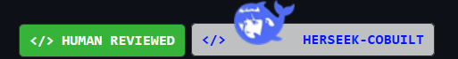
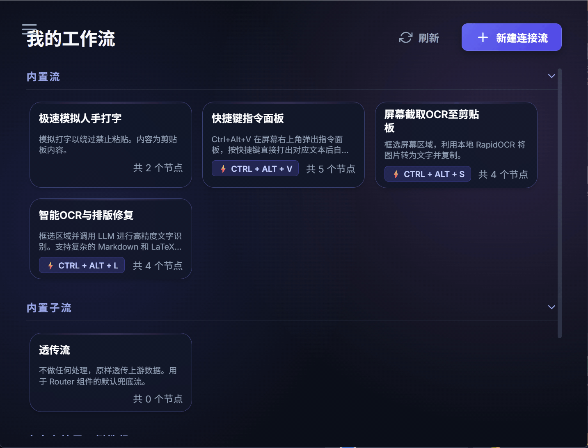

   <h1>ShortcutFlow</h1>
  

    
    
    
    
  

  

    
  

  

---

## 安装指导
1. 前往 [最新发布](https://github.com/2bitbit/ShortcutFlow/releases/latest) 下载压缩包（含3个目录和一个安装程序）
2. 执行安装程序/程式
3. 把压缩包内的目录放到根目录下

完成。

## 简略介绍
**ShortcutFlow** 是一个轻量、低内存占用、高拓展性的工作流编排框架，自动化你的日常所需，显著提升效率，不打断你的心流。

它可以让你将繁琐的日常键鼠操作、剪贴板处理、甚至是与大语言模型 (LLM) 的多步交互，统统编排为可视化节点，并允许自定义流，然后**绑定到一个全局快捷键上瞬间触发**。

## 🧩 拼出个未来
### 🧩 开箱即用的内置流
- 极速模拟人手打字（绕过禁止粘贴）
- 快捷键指令面板（一键唤起面板，一键 type 出预置内容）
- 屏幕截取OCR至剪贴板（本地运行，快速 OCR）
- 智能OCR与排版修复（支持latex、markdown识别）

### 🧩 开箱即用的内置节点
ShortcutFlow 预装了多种针对桌面环境深度优化的内置组件：

| 节点组件                 | 连通性约定  | 描述说明                                                                               |
| ------------------------ | ----------- | -------------------------------------------------------------------------------------- |
| 📸 **ScreenCapture**     | *产生数据*  | 唤起系统级框选截图，并将其转化为 Base64 长文本推入管线。                               |
| 📋 **ReadClipboard**     | *产生数据*  | 静默读取系统剪贴板当前的纯文本内容作为初始数据源。                                     |
| ⌨️ **Typing**             | *依赖输入*  | 真实的键盘模拟器。接收流数据，以硬件驱动级别逐个字符敲击输出（专治禁用粘贴的网页）。   |
| 🤖 **LLM**               | *输入/产出* | 系统大脑枢纽。接收任意文本或图像流，发送给大模型进行结构化，并返回纯净推理结果。       |
| 📥 **Paste**             | *依赖输入*  | 流程终结者。拦截上游传导的数据并覆盖到剪贴板，向失焦处触发完美的原生 `Ctrl+V`。        |
| 🖥️ **Shell**              | *自由支配*  | 极其灵活的执行器。将上游数据压入 `stdin` 并执行任意工作区的本地可执行命令（60s 硬超时）。 |
| 🔔 **Popup**             | *依赖输入*  | 消息广播者。利用操作系统的原生系统级弹窗，醒目地通知上游数据内容。                     |
| 🌐 **HtmlWindow**        | *依赖输入*  | 弹出自定义 HTML 窗口。支持阻塞/非阻塞、置顶、自定义尺寸位置。                          |
| 🔀 **Router**            | *输入/产出* | 条件路由器。按正则/字符数等条件匹配 payload，命中后执行对应子流。                       |
| ⌨️ **KeyListener**        | *产生数据*  | 阻塞等待用户按下指定快捷键，返回对应 metadata/payload 给下游。                         |
| 🌍 **HttpRequest**       | *产生数据*  | 发射 HTTP 请求（GET/POST/PUT/DELETE），将响应体传递给下游节点。                        |
| 🔄 **CallFlow**          | *输入/产出* | 执行子流程：通过 `flow_id` 触发并运行另一个已配置的工作流。                             |
| 🔍 **Regex**             | *输入/产出* | 对 payload 按正则表达式替换。支持捕获组、反向引用。                                     |
| 🖱️ **SimulateKey**        | *产生数据*  | 按键序列模拟器。可编排复杂按键组合（如 `Ctrl+C`）的序列执行。                           |
| 📋 **Copy**              | *产生数据*  | 向焦点区触发模拟 `Ctrl+C` 复制文本或图片（Base64）到剪贴板。                            |
| 📝 **WriteClipboard**    | *依赖输入*  | 将上游 payload 写入系统剪贴板。                                                        |
| 🧹 **ClearClipboard**    | *产生数据*  | 清空系统剪贴板内容。                                                                   |
### 🧩 简单地自定义你的组件
- 可参考 https://github.com/2bitbit/ShortcutFlow/tree/main/docs 内的教程。
- 可参考内置示例的自定义组件。

 

  成都之心：🍑

